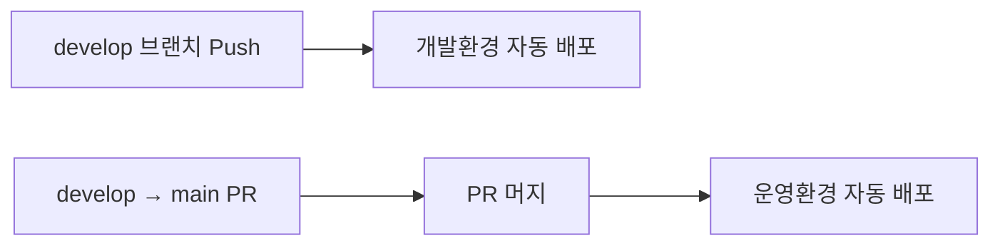

# 🐳 Docker & GitHub Actions 배포 가이드

## 1. GitHub Actions 자동 배포 설정

### 📦 GitHub Secrets 설정

GitHub 레포지토리의 Settings > Secrets and variables > Actions에서 다음 시크릿을 추가:

#### 필수 Secrets
```yaml
GH_TOKEN                    # GitHub Personal Access Token
LIGHTSAIL_HOST             # AWS Lightsail IP 주소
LIGHTSAIL_SSH_KEY          # SSH 개인키 (전체 내용)
NEXT_PUBLIC_SUPABASE_URL   # Supabase URL
NEXT_PUBLIC_SUPABASE_ANON_KEY  # Supabase Anon Key
SUPABASE_SERVICE_ROLE_KEY  # Service Role Key
NEXT_PUBLIC_PORTONE_STORE_ID  # PortOne Store ID
PORTONE_API_SECRET         # PortOne API Secret
NEXT_PUBLIC_PORTONE_CHANNEL_KEY_GENERAL     # 일반결제 채널
NEXT_PUBLIC_PORTONE_CHANNEL_KEY_SUBSCRIPTION # 구독결제 채널
```

### 🔑 GitHub Personal Access Token 생성

1. GitHub > Settings > Developer settings > Personal access tokens
2. "Generate new token (classic)" 클릭
3. 권한 선택:
   - ✅ `repo` (전체)
   - ✅ `write:packages` (GitHub Container Registry)
   - ✅ `delete:packages` (선택사항)
4. 토큰을 `GH_TOKEN` Secret으로 추가

### 🚀 배포 플로우



## 2. AWS Lightsail 설정

### 🔧 초기 설정

```bash
# 1. Docker 설치 (Ubuntu/Debian)
sudo apt update
sudo apt install docker.io docker-compose -y
sudo systemctl start docker
sudo systemctl enable docker
sudo usermod -aG docker $USER

# 2. 프로젝트 디렉토리 생성
mkdir -p /home/ec2-user/badminton
cd /home/ec2-user/badminton

# 3. Git 레포지토리 클론
git clone https://github.com/YOUR_USERNAME/badminton.git .
```

### 🔐 SSH 키 설정

```bash
# 1. 로컬에서 SSH 키 생성
ssh-keygen -t rsa -b 4096 -f lightsail_key

# 2. 공개키를 서버에 추가
cat lightsail_key.pub | ssh ec2-user@YOUR_IP "cat >> ~/.ssh/authorized_keys"

# 3. 개인키를 GitHub Secret으로 추가 (LIGHTSAIL_SSH_KEY)
cat lightsail_key  # 이 내용 전체를 복사
```

## 3. 수동 배포

### 🎯 빠른 배포 스크립트

```bash
# 서버에 접속
ssh -i lightsail_key ec2-user@YOUR_LIGHTSAIL_IP

# 프로젝트 디렉토리로 이동
cd /home/ec2-user/badminton

# 최신 코드 가져오기
git pull origin main

# 배포 스크립트 실행
chmod +x scripts/manual-deploy.sh
./scripts/manual-deploy.sh
```

### 🔄 긴급 롤백

```bash
# 이전 이미지로 롤백
docker stop badminton-prod
docker rm badminton-prod
docker run -d --name badminton-prod \
  -p 3030:3000 \
  --restart unless-stopped \
  badminton-prod:previous  # 이전 태그 사용
```

## 4. Docker 운영 명령어

### 📊 모니터링

```bash
# 실시간 로그
docker logs -f badminton-prod --tail 100

# 컨테이너 상태
docker stats badminton-prod

# 리소스 사용량
docker system df

# 헬스체크
curl -f http://localhost:3030/api/health || echo "Health check failed"
```

### 🧹 정리 및 유지보수

```bash
# 안전한 정리 (운영중인 컨테이너 제외)
docker system prune -a --filter "until=24h"

# 디스크 공간 확보
docker image prune -a -f
docker volume prune -f
docker builder prune -f

# 로그 크기 제한 설정
docker run -d \
  --log-opt max-size=10m \
  --log-opt max-file=3 \
  --name badminton-prod \
  ...
```

### 🔍 디버깅

```bash
# 컨테이너 내부 접속
docker exec -it badminton-prod sh

# 환경변수 확인
docker exec badminton-prod env | grep NEXT_PUBLIC

# 네트워크 확인
docker port badminton-prod
netstat -tuln | grep 3030

# 프로세스 확인
docker top badminton-prod
```

## 5. nginx 설정 (리버스 프록시)

### 📝 nginx 설정 파일

```nginx
# /etc/nginx/sites-available/badmate.club
server {
    listen 80;
    server_name badmate.club www.badmate.club;
    return 301 https://$server_name$request_uri;
}

server {
    listen 443 ssl http2;
    server_name badmate.club www.badmate.club;

    ssl_certificate /etc/letsencrypt/live/badmate.club/fullchain.pem;
    ssl_certificate_key /etc/letsencrypt/live/badmate.club/privkey.pem;

    location / {
        proxy_pass http://localhost:3030;
        proxy_http_version 1.1;
        proxy_set_header Upgrade $http_upgrade;
        proxy_set_header Connection 'upgrade';
        proxy_set_header Host $host;
        proxy_cache_bypass $http_upgrade;
        proxy_set_header X-Real-IP $remote_addr;
        proxy_set_header X-Forwarded-For $proxy_add_x_forwarded_for;
        proxy_set_header X-Forwarded-Proto $scheme;
        proxy_set_header X-Forwarded-Host $host;

        # 타임아웃 설정 (502 에러 방지)
        proxy_connect_timeout 60s;
        proxy_send_timeout 60s;
        proxy_read_timeout 60s;
    }
}
```

### 🔒 SSL 인증서 설정 (Let's Encrypt)

```bash
# Certbot 설치
sudo apt install certbot python3-certbot-nginx

# SSL 인증서 발급
sudo certbot --nginx -d badmate.club -d www.badmate.club

# 자동 갱신 설정
sudo systemctl enable certbot.timer
```

## 6. 트러블슈팅

### 🚨 일반적인 문제 해결

#### 502 Bad Gateway
```bash
# 1. 컨테이너 상태 확인
docker ps -a | grep badminton

# 2. 컨테이너 로그 확인
docker logs badminton-prod --tail 50

# 3. 환경변수 확인
docker exec badminton-prod env | grep SITE_URL

# 4. 재시작
docker restart badminton-prod
```

#### 디스크 공간 부족
```bash
# 1. 디스크 사용량 확인
df -h
docker system df

# 2. Docker 정리
docker system prune -af --volumes

# 3. 로그 정리
sudo journalctl --vacuum-time=3d
truncate -s 0 /var/lib/docker/containers/*/*-json.log
```

#### 메모리 부족
```bash
# 1. 메모리 사용량 확인
free -h
docker stats --no-stream

# 2. 스왑 추가 (필요시)
sudo fallocate -l 2G /swapfile
sudo chmod 600 /swapfile
sudo mkswap /swapfile
sudo swapon /swapfile
```

#### 컨테이너 무한 재시작
```bash
# 1. 재시작 정책 변경
docker update --restart no badminton-prod

# 2. 로그 확인 및 문제 해결
docker logs badminton-prod --tail 100

# 3. 정상화 후 재시작 정책 복구
docker update --restart unless-stopped badminton-prod
```

## 7. 성능 최적화

### ⚡ Docker 이미지 최적화

```dockerfile
# 멀티 스테이지 빌드 사용
FROM node:20-alpine AS deps
# 의존성만 설치

FROM node:20-alpine AS builder
# 빌드 수행

FROM node:20-alpine AS runner
# 최종 실행 이미지 (최소화)
```

### 🚀 빌드 캐시 활용

```bash
# BuildKit 활성화
export DOCKER_BUILDKIT=1

# 캐시 마운트 사용
docker build \
  --cache-from type=registry,ref=ghcr.io/username/badminton:cache \
  --cache-to type=registry,ref=ghcr.io/username/badminton:cache \
  .
```

## 8. 모니터링

### 📈 헬스체크 설정

```dockerfile
# Dockerfile에 추가
HEALTHCHECK --interval=30s --timeout=3s --start-period=60s --retries=3 \
  CMD node healthcheck.js || exit 1
```

```javascript
// healthcheck.js
const http = require('http');

const options = {
  host: 'localhost',
  port: 3000,
  path: '/api/health',
  timeout: 2000
};

const request = http.request(options, (res) => {
  process.exit(res.statusCode === 200 ? 0 : 1);
});

request.on('error', () => process.exit(1));
request.end();
```

### 📊 로그 수집

```bash
# Prometheus + Grafana 설정 (선택사항)
docker run -d \
  --name prometheus \
  -p 9090:9090 \
  -v /path/to/prometheus.yml:/etc/prometheus/prometheus.yml \
  prom/prometheus

docker run -d \
  --name grafana \
  -p 3000:3000 \
  grafana/grafana
```

## 9. 백업 및 복구

### 💾 데이터 백업

```bash
# Docker 볼륨 백업
docker run --rm \
  -v badminton-data:/data \
  -v $(pwd):/backup \
  alpine tar czf /backup/backup.tar.gz /data

# 데이터베이스 백업 (Supabase)
# Supabase 대시보드에서 자동 백업 설정
```

### 🔄 복구 절차

```bash
# 1. 컨테이너 중지
docker stop badminton-prod

# 2. 데이터 복원
docker run --rm \
  -v badminton-data:/data \
  -v $(pwd):/backup \
  alpine tar xzf /backup/backup.tar.gz -C /

# 3. 컨테이너 재시작
docker start badminton-prod
```

## 10. 체크리스트

### 🚀 배포 전
- [ ] 모든 환경변수 설정 확인
- [ ] GitHub Secrets 모두 설정
- [ ] SSH 키 설정 완료
- [ ] Docker 설치 확인
- [ ] nginx 설정 완료
- [ ] SSL 인증서 설정

### ✅ 배포 후
- [ ] 사이트 접속 확인
- [ ] 로그인 기능 테스트
- [ ] API 응답 확인
- [ ] 로그 모니터링
- [ ] 리소스 사용량 확인
- [ ] 백업 설정 확인

## 📚 참고 자료

- [Docker 공식 문서](https://docs.docker.com)
- [GitHub Actions 문서](https://docs.github.com/actions)
- [AWS Lightsail 가이드](https://lightsail.aws.amazon.com/ls/docs)
- [nginx 문서](https://nginx.org/en/docs)

---

**문서 버전:** 1.0
**작성일:** 2025-01-18
**작성자:** Claude (AI Assistant)